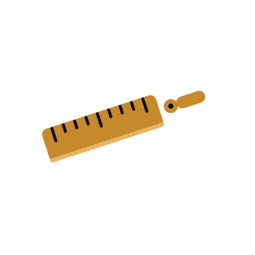
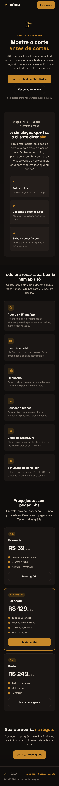
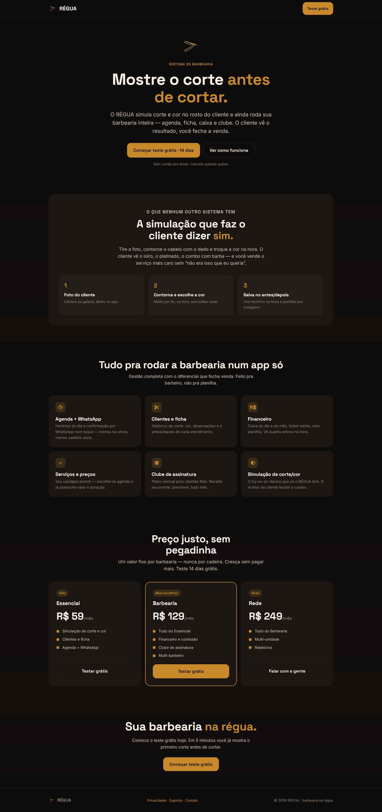
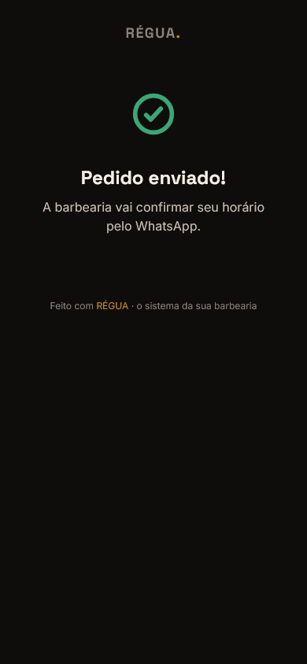
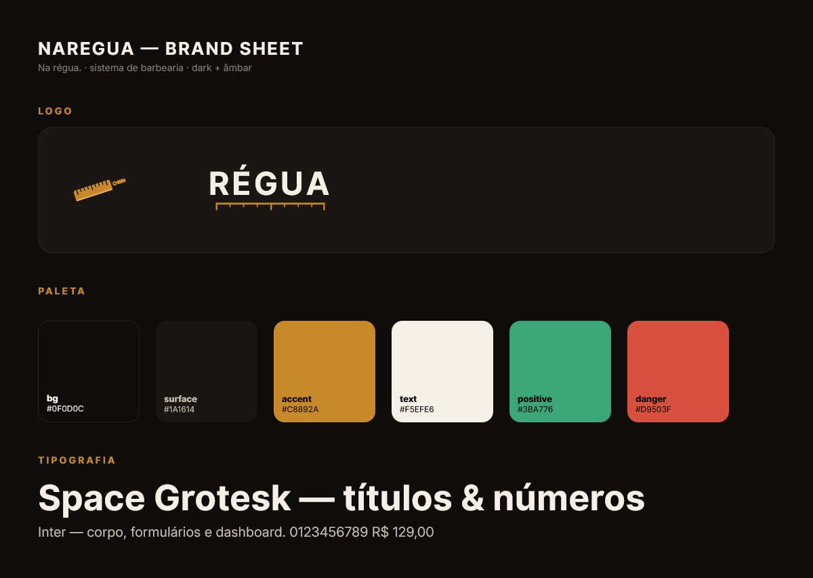

# RÉGUA

**A barbearia inteira num app — com o simulador de corte e cor que faz o cliente dizer "é esse" antes da primeira tesourada.**

_Na régua._

---

O **RÉGUA** é o sistema completo da sua barbearia — agenda, ficha do cliente, caixa, comissão da equipe e clube de assinatura, tudo num app só, feito **pra barbeiro, não pra planilha**.

E o que **nenhum outro sistema de barbearia do Brasil tem**: um **simulador de corte e cor** que mostra o resultado no rosto do cliente **antes** de você encostar a tesoura. O cliente vê, aprova — e você fecha a venda com o combo mais caro, sem risco de arrependimento.

> **Não é só mais uma agenda.** É o sistema que fecha a venda na cadeira.

---

## 💈 Por que o dono de barbearia usa

- **Fim do "não era isso que eu queria".** O cliente aprova o visual **na tela**, com a própria cara. Você corta com segurança e sem retrabalho — e aquela cadeira deixa de virar prejuízo.
- **Vende o serviço mais caro sem empurrar.** Quando o cliente **vê** o loiro, o platinado ou o combo com barba, ele mesmo pede. Você só mostra.
- **Menos cadeira vazia.** Agenda do dia + confirmação por **WhatsApp** num toque — menos no-show, mais faturamento.
- **Caixa fechado sem planilha.** Faturamento do dia e do mês, ticket médio e **comissão da equipe calculada sozinha**. Você vê quanto entrou na hora.
- **Receita todo mês, garantida.** Clube de assinatura com plano mensal pros clientes fiéis — dinheiro previsível caindo sem depender de movimento.
- **Portfólio que trabalha por você.** Cada antes/depois vira histórico na ficha do cliente e conteúdo pronto pro Instagram da barbearia.

---

## ✂️ O diferencial: a simulação que faz o cliente dizer *sim*

Tire a foto, contorne o cabelo com o dedo e troque a cor na hora. O cliente vê o loiro, o platinado, o combo com barba — e você vende o serviço mais caro **sem "não era isso que eu queria"**.

| Passo | O que acontece |
|:---:|---|
| **1. Foto do cliente** | Câmera ou galeria, direto no app. |
| **2. Contorna e escolhe a cor** | Matte por fio, na hora, sem editar nada — roda **no próprio aparelho** (a foto do cliente não sai do dispositivo). |
| **3. Salva no antes/depois** | Vira histórico na ficha e portfólio pro Instagram. |

Concorrente nenhum de gestão (AppBarber, Trinks, Booksy) faz isso. Os apps de try-on que existem não rodam a sua barbearia. O RÉGUA faz **os dois**.

---

## 🧰 Tudo pra rodar a barbearia num app só

| | Recurso | O que resolve |
|:---:|---|---|
| ⏱️ | **Agenda + WhatsApp** | Horários do dia e confirmação por WhatsApp num toque — menos no-show, menos cadeira vazia. |
| ✂️ | **Clientes e ficha** | Histórico de corte, cor, observações e o antes/depois de cada atendimento. |
| 💰 | **Financeiro** | Caixa do dia e do mês, ticket médio, sem planilha. Vê quanto entrou na hora. |
| 👥 | **Equipe e comissão** | Cada barbeiro com sua comissão calculada automática — inclusive por serviço. |
| 📋 | **Serviços e preços** | Seu cardápio pronto: escolhe na agenda e já preenche valor e duração. |
| ♻️ | **Clube de assinatura** | Plano mensal pros clientes fiéis. Receita recorrente, previsível, todo mês. |
| 🪄 | **Simulação de corte/cor** | O try-on on-device que **só o RÉGUA tem** — o motivo de o cliente fechar o combo. |
| 🗓️ | **Link de agendamento** | Página pública da sua barbearia: o cliente pede horário, você confirma. |

---

## 💵 Planos

Um valor **fixo por barbearia** — nunca por cadeira. Cresça a equipe sem pagar mais.

| | **Essencial** | **Barbearia** ⭐ | **Rede** |
|---|:---:|:---:|:---:|
| **Preço** | **R$ 59**/mês | **R$ 129**/mês | **R$ 249**/mês |
| Pra quem | Barbeiro solo | A barbearia que quer crescer | Mais de uma unidade |
| Simulação de corte e cor | ✅ | ✅ | ✅ |
| Clientes, ficha e agenda | ✅ | ✅ | ✅ |
| Agenda + WhatsApp | ✅ | ✅ | ✅ |
| Financeiro e comissão | — | ✅ | ✅ |
| Clube de assinatura | — | ✅ | ✅ |
| Multi-barbeiro | — | ✅ | ✅ |
| Multi-unidade + relatórios | — | — | ✅ |

> ⭐ **Barbearia** é o plano mais escolhido — gestão completa com o diferencial que fecha venda.

**14 dias grátis, sem cartão.** Cancela quando quiser. Cobrança **no site via PIX** — sem taxa de loja no meio, o dinheiro é seu.

### [➡️ Começar o teste grátis em regua.web.app](https://regua.web.app)

---

## 🖥️ Veja por dentro

  

---

## 🎨 Identidade

Dark + acento âmbar, tipografia **Space Grotesk + Inter**, símbolo navalha-régua (a lâmina é uma régua graduada).

---

## 🔗 Saiba mais

- **Conhecer / testar grátis:** https://regua.web.app
- **Página do projeto:** https://paulocodex.com/p/regua

---

## 👤 Sobre o desenvolvedor

**Paulo Adriel** é produtor de vídeo e desenvolvedor indie brasileiro. Construo o produto **e** a apresentação dele — código + identidade visual, motion e material de lançamento — do zero ao ar em 30 dias. Trabalho de forma aberta e escuto quem usa. Estúdio [**Paulocodex**](https://paulocodex.com).

 

---

📧 [paulobatista19988@proton.me](mailto:paulobatista19988@proton.me) &nbsp;·&nbsp; 🌐 [paulocodex.com](https://paulocodex.com) &nbsp;·&nbsp; 📸 [Instagram](https://instagram.com/paulo.videodev) &nbsp;·&nbsp; 💼 [LinkedIn](https://www.linkedin.com/in/paulo-adriel/) &nbsp;·&nbsp; 🐙 [github.com/Paulothedeveloper](https://github.com/Paulothedeveloper)

_Repositório de **apresentação pública** — o código-fonte é fechado. Nada de dado ou segredo aqui._

